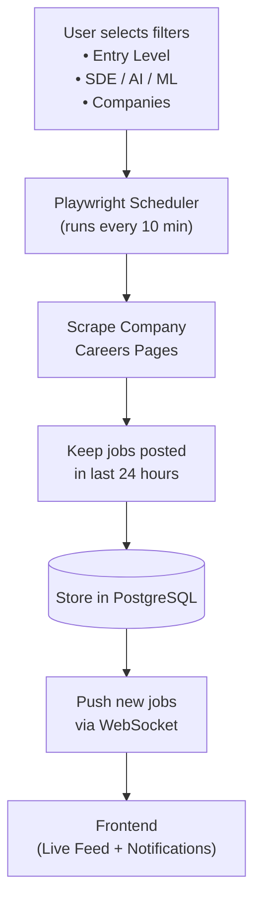

# Job Scraper

A real-time job scraper that continuously monitors company career pages, filters for freshly posted roles, and streams new matches to a live frontend feed with notifications.

Users pick what they care about — **Entry Level** roles, **SDE / AI / ML** tracks, and specific **Companies** — and the system does the rest: scraping on a schedule, keeping only jobs posted in the last 24 hours, persisting them, and pushing new hits to the browser the moment they appear.

---

## Features

- **User-driven filters** — select by experience level (Entry Level), role category (SDE / AI / ML), and target companies.
- **Scheduled scraping** — a Playwright-based scheduler crawls company career pages every 10 minutes.
- **Freshness window** — only jobs posted in the last 24 hours are kept.
- **Durable storage** — matched jobs are stored in PostgreSQL.
- **Real-time delivery** — newly discovered jobs are pushed to the frontend over WebSockets.
- **Live feed + notifications** — the frontend renders an always-updating feed and alerts you to new roles.

---

## Architecture



### Flow

```
User selects:
• Entry Level
• SDE / AI / ML
• Companies

        ↓
Playwright Scheduler (every 10 min)

        ↓
Scrape Company Careers Pages

        ↓
Keep jobs posted in last 24 hours

        ↓
Store in PostgreSQL

        ↓
Push new jobs via WebSocket

        ↓
Frontend (Live Feed + Notifications)
```

### Pipeline stages

| Stage | Responsibility |
| --- | --- |
| **Filters** | Capture user preferences (level, category, companies) that scope what gets scraped and surfaced. |
| **Scheduler** | Trigger scraping runs on a fixed 10-minute cadence using Playwright. |
| **Scraper** | Load and parse each company's careers page, extracting job title, link, location, and posted time. |
| **Freshness filter** | Discard anything older than 24 hours so the feed only shows current openings. |
| **Storage** | Upsert jobs into PostgreSQL, deduplicating so each role is stored once. |
| **WebSocket push** | Emit only newly inserted jobs to connected clients in real time. |
| **Frontend** | Display a live feed and raise notifications as new jobs arrive. |

---

## Tech Stack

- **Scraping:** [Playwright](https://playwright.dev/)
- **Scheduling:** interval-based scheduler (every 10 minutes)
- **Database:** PostgreSQL
- **Real-time transport:** WebSockets
- **Frontend:** live feed UI with notifications

---

## Getting Started

> The application code is not yet added to this repository. The steps below describe the intended setup once the services are implemented.

### Prerequisites

- Node.js 18+ (or Python 3.11+, depending on implementation)
- PostgreSQL 14+
- Playwright browsers installed

### Setup

```bash
# 1. Clone the repository
git clone https://github.com/ChetanyaRathi/job-scraper.git
cd job-scraper

# 2. Install dependencies
# (e.g. for Node.js)
npm install
npx playwright install

# 3. Configure environment
cp .env.example .env
# set DATABASE_URL, scrape interval, target companies, etc.

# 4. Run database migrations
npm run migrate

# 5. Start the backend (scheduler + WebSocket server)
npm run start:server

# 6. Start the frontend
npm run start:web
```

### Environment variables

| Variable | Description |
| --- | --- |
| `DATABASE_URL` | PostgreSQL connection string. |
| `SCRAPE_INTERVAL_MINUTES` | How often to scrape (default: `10`). |
| `FRESHNESS_HOURS` | Max job age to keep (default: `24`). |
| `WS_PORT` | Port for the WebSocket server. |

---

## Roadmap

- [ ] Implement Playwright scrapers per company careers page
- [ ] Add scheduler with configurable interval
- [ ] Define PostgreSQL schema and migrations
- [ ] Build WebSocket server for real-time job pushes
- [ ] Build frontend live feed + notifications
- [ ] Add user filter persistence (Entry Level / SDE / AI / ML / Companies)

---

## License

MIT
