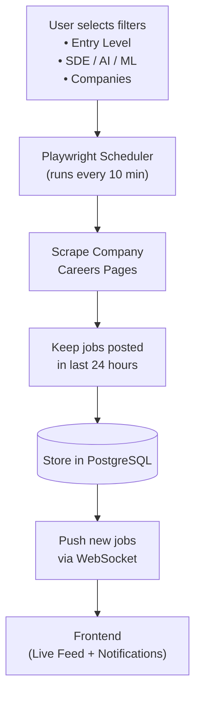

# Job Scraper

A real-time job scraper that continuously monitors company career pages, filters for freshly posted roles, and streams new matches to a live frontend feed with notifications.

Users pick what they care about — **Entry Level** roles, **SDE / AI / ML** tracks, and specific **Companies** — and the system does the rest: scraping on a schedule, keeping only jobs posted in the last 24 hours, persisting them, and pushing new hits to the browser the moment they appear.

---

## Features

- **User-driven filters** — select by experience level (Entry Level), role category (SDE / AI / ML), and target companies.
- **Scheduled scraping** — a Playwright-based scheduler crawls company career boards every 10 minutes.
- **Freshness window** — only jobs posted (or first seen) in the last 24 hours are kept in the feed.
- **Durable storage** — matched jobs are stored in PostgreSQL with deduplication.
- **Real-time delivery** — newly discovered jobs are pushed to the frontend over WebSockets.
- **Live feed + notifications** — the frontend renders an always-updating feed and optional browser alerts.

---

## Architecture



### Flow

```
User selects:
• Entry Level
• SDE / AI / ML
• Companies

        ↓
Playwright Scheduler (every 10 min)

        ↓
Scrape Company Careers Pages

        ↓
Keep jobs posted in last 24 hours

        ↓
Store in PostgreSQL

        ↓
Push new jobs via WebSocket

        ↓
Frontend (Live Feed + Notifications)
```

---

## Tech Stack

| Layer | Choice |
| --- | --- |
| Scraping | Playwright request API (Greenhouse + Lever + Ashby) |
| Company config | `server/data/companies.json` (**15,000+** boards) |
| Scheduling | Interval scheduler (default every 10 minutes) |
| Database | PostgreSQL |
| API | Express |
| Real-time | WebSockets (`ws`) |
| Frontend | React + Vite |

### Company coverage

Board tokens are loaded from `server/data/companies.json` (Greenhouse, Lever, Ashby).

Rebuild/update the list anytime:

```bash
npm run companies:build
```

This pulls public ATS board indexes and writes a fresh config (currently ~15k companies).

---

## Project layout

```
server/src/          Backend API, scraper, scheduler, WebSocket hub
web/src/             Live feed UI
docker-compose.yml   Local PostgreSQL
```

---

## Getting Started

### Prerequisites

- Node.js 18+
- Docker (for PostgreSQL)
- Playwright browsers (`npx playwright install chromium`)

### Setup

```bash
# 1. Install dependencies
npm install
npx playwright install chromium

# 2. Start PostgreSQL
npm run db:up

# 3. Configure environment
cp .env.example .env

# 4. Run migrations
npm run migrate

# 5. Start API + frontend together
npm run dev
```

Then open **http://localhost:5173**

- API / WebSocket: `http://localhost:3001` · `ws://localhost:3001/ws`
- Manual scrape: `POST /api/scrape` or the **Scrape now** button in the UI

### Useful scripts

| Script | Description |
| --- | --- |
| `npm run dev` | Start server + frontend |
| `npm run migrate` | Create/update DB schema |
| `npm run scrape:once` | Run one scrape cycle |
| `npm run db:up` / `db:down` | Start/stop Postgres |

### Environment variables

| Variable | Description |
| --- | --- |
| `DATABASE_URL` | PostgreSQL connection string |
| `PORT` | API / WebSocket port (default `3001`) |
| `SCRAPE_INTERVAL_MINUTES` | How often to scrape (default `10`) |
| `FRESHNESS_HOURS` | Max job age to keep (default `24`) |
| `SCRAPE_ON_START` | Run a scrape when the server boots (default `false`) |
| `SCRAPE_CONCURRENCY` | Parallel company fetches (default `40`) |
| `SCRAPE_LIMIT` | Cap companies per cycle; `0` = all (default `0`) |
| `USA_ONLY` | Keep only USA / US-remote jobs (default `true`) |

---

## How filtering works

1. Playwright pulls jobs from each company's Greenhouse or Lever board.
2. Titles/descriptions are classified into **SDE / AI / ML** and experience levels (including **Entry Level**).
3. Locations are filtered to **USA only** (US cities/states, United States, US-remote). Non-US roles are dropped.
4. Jobs older than `FRESHNESS_HOURS` are dropped (when `posted_at` is available).
5. New rows are inserted into Postgres (`ON CONFLICT DO NOTHING`).
6. Inserts are broadcast over WebSockets; each client only receives jobs matching its selected filters.

---

## License

MIT
